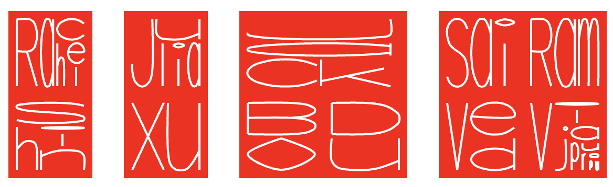

# APack: Alphabet Packing Writing System

**APack** is a writing system that explores writing alphabets in a Chinese character style. Instead of placing letters sequentially, APack packs letters for one word into a single grid.

English and Chinese use fundamentally different writing systems. In English or other Latin scripts, letters are pre-defined and arranged in a linear sequence. In contrast, Chinese characters are spatially composed using strokes rather than following a strict left-to-right structure.

What if we could write English in a Chinese-style manner—arranging the letters of a word spatially into a single unified character? Potential applications include stamps, wallpapers, concrete poems, icons, and more.



## Get started

You can create your own piece using the online [APack editor](https://apack.bairui.dev/). If you’d like to use APack in your project, it’s also available as a JavaScript package, just follow the instructions below to get started.

```bash
$ npm install apackjs -S
```

```js
import * as ap from "apackjs";

const node = ap.text("hello world").render();

document.body.append(node);
```

## API Reference

<a href="#ap-text" id="ap-text">#</a> ap.**text**(_content[, options]_)

Renders the given content with optional styling and layout options.

```js
ap.text("hello world");
```


<a href="#options-cellsize" id="options-cellsize">#</a> options.**cellSize**

Sets the size of each cell.

```js
ap.text("hello world", {cellSize: 200});
```


<a href="#options-cellwidth" id="options-cellwidth">#</a> options.**cellWidth**

<a href="#options-cellheight" id="options-cellheight">#</a> options.**cellHeight**

Sets the dimensions of each cell, defaults to [options.cellSize](#options-cellsize).

```js
ap.text("hello world", {
  cellWidth: 320,
  cellHeight: 320,
  style: {styleBackground: "#F1BB4D"},
  word: {stroke: "#492577", strokeWidth: 10},
  font: "astrology",
});
```


<a href="#options-font" id="options-font">#</a> options.**font**

Specifies the font to use for rendering.

```js
ap.text("hello world", {font: "astrology"});
```


<a href="#options-layout" id="options-layout">#</a> options.**layout**

Set the layout for packing.

```js
ap.text("hello world", {
  layout: {type: "treemap", grid: true},
});
```


<a href="#options-word" id="options-word">#</a> options.**word**

Customizes the word styling.

```js
ap.text("hello world", {
  word: {
    stroke: "red",
    strokeWidth: 3,
    fill: "none",
  },
});
```


<a href="#options-style" id="options-style">#</a> options.**style**

Configures the overall style of the output.

```js
ap.text("hello world", {
  style: {
    styleBackground: "red",
  },
});
```


<a href="#options-grid" id="options-grid">#</a> options.**grid**

Adds and customizes a grid overlay.

```js
ap.text("hello world", {
  grid: {
    stroke: "#ccc",
    fill: "none",
  },
});
```


<a href="#options-padding" id="options-padding">#</a> options.**padding**

Sets the padding around the content.

```js
ap.text("hello world", {padding: 0.2, grid: true});
```


