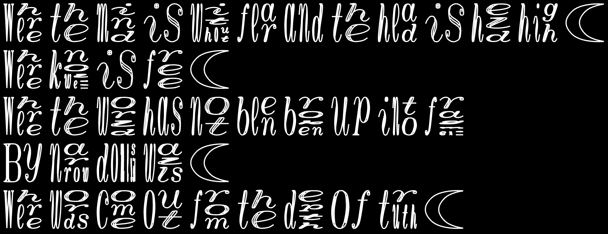
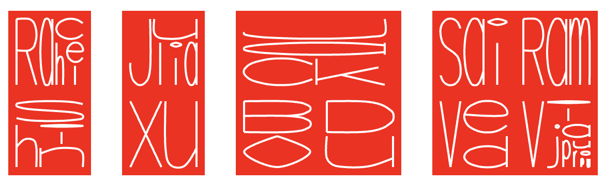
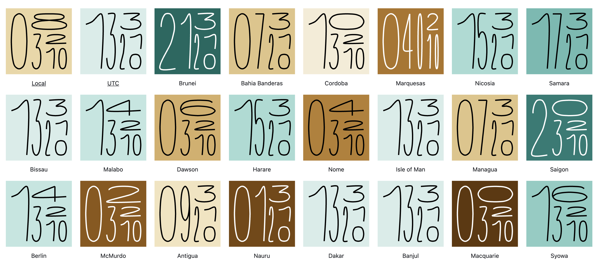

# APack

**Write a word. Pack it into a glyph. Let alphabet become drawing.**

[](https://apack.bairui.dev/)
[](https://bairui.dev/apack)



APack is an alphabet-packing writing system that writes Latin text in the visual grammar of Chinese characters. Instead of placing letters one after another, it compresses each word into a square-ish cell: letters become strokes, words become glyphs, and writing starts behaving like drawing.

It began as an assignment for Allison Parrish's [Computational Letterforms and Layout](https://cll.decontextualize.com/) class at ITP, first prototyped in [Observable](https://observablehq.com/d/3d4704d5b7d5ac6f), then expanded into an online editor, JavaScript package, Python notebook helper, Name2Tree stamp system, and a field of world clocks.

**You are welcome here.** Open the [live editor](https://apack.bairui.dev/), type a name, poem, slogan, or stray phrase, and tune the layout until the alphabet turns into something you can recognize and something you have to look at twice.

> *Writing can be a line of text. It can also be a small architecture.*

[**Try the editor →**](https://apack.bairui.dev/) · [**Read the story →**](https://bairui.dev/apack) · [**See world clocks →**](https://apack.bairui.dev/aclock/)

## What it does

1. **Pack:** Each word is assigned to a cell; each letter receives a sub-cell through recursive layout.
2. **Draw:** Letters render as SVG paths from Hershey fonts, stroked, filled, connected in cursive mode, or styled for stamps and posters.
3. **Compose:** Text becomes stamps, logos, wallpapers, concrete poems, signatures, labels, and visual marks.
4. **Edit:** The online editor merges source text and rendered output into one canvas-like writing surface, so editing feels more like drawing than typing into a split preview pane.
5. **Stamp:** [Name2Tree](https://tree.bairui.dev/) uses APack to sign each generated tree with a Chinese-character-like name stamp.
6. **Tell time:** [World Clocks](https://apack.bairui.dev/aclock/) packs hour, minute, and second digits into animated square clocks for many time zones.



## Why it exists

The inspiration comes from the visual richness of Chinese characters. Each character is a carefully composed unit that fits within a square space, with strokes arranged in balanced harmony. English and Chinese use radically different spatial habits. Latin letters usually unfold in a line. Chinese characters gather strokes into a balanced square. APack asks: what happens if English words are no longer a sequence, but a composition?

The project is not trying to imitate Chinese calligraphy as ornament. It is a small system for thinking with two writing logics at once: the alphabetic legibility of Latin text and the spatial density of character-like construction. A familiar name becomes strange enough to look at again, and that strangeness is useful. A name can become a stamp. A phrase can become a poster. A poem can become a texture. A clock can become a glyph that changes every second.

APack was shown with [Find Trees in Names](https://bairui.dev/name2tree) at ITP Spring Show 2025. Visitors grew trees from their names and received APack stamps as marks of authorship; later, those stamps were planted into the infinite landscape [{Mountains, Trees, Names}*](https://landscape.bairui.dev/). During the show, people could also try the editor directly. Many kept typing to figure out how it works, and a lot of them thought it would make a great logo generator. [Photos and videos from the show →](https://bairui.dev/apack#itp-spring-show-2025)

After the show, my friend [Sai](https://www.instagram.com/sairamved/) used APack for a poster in the FIGHT FOR KINDNESS design activity: [*Stick Together to Make Peace*](https://www.typecampus.com/fight-for-kindness-gallery-2025?pgid=maasv5d321-b22ea6e7-6be1-4b74-83e0-33c9d3d25d56). I also noticed that packing digits into a single cell is a natural way to draw a clock, which led to [World Clocks](https://apack.bairui.dev/aclock/). I was surprised how many time zones exist, and it is fun to watch the animations and try different fonts.

<a href="https://apack.bairui.dev/aclock/"></a>

## How it works

The core idea is to recursively divide space and place each letter until all letters are placed.

```
Text input
    │
    ▼
┌─────────────────────────────────────┐
│  Split into words                   │  one output cell per word
│  Choose cell size / width / height  │
└─────────────────────────────────────┘
    │
    ▼
┌─────────────────────────────────────┐
│  Layout letters                     │  flex or treemap packing
│  Recursive cell subdivision         │
└─────────────────────────────────────┘
    │
    ▼
┌─────────────────────────────────────┐
│  Hershey font paths                 │  futural, astrology, symbolic, etc.
│  Scale each letter into its cell    │
└─────────────────────────────────────┘
    │
    ▼
┌─────────────────────────────────────┐
│  SVG render                         │  stroke, fill, cursive, grid, background
│  Export / embed / animate elsewhere │
└─────────────────────────────────────┘
```

**Layout** (`src/flex.js`, `src/treemap.js`): `flex` recursively splits the previous letter cell into horizontal or vertical pieces based on character codes, producing structures that feel closer to Chinese character composition. `treemap` uses D3's binary treemap tiling to make compact, poster-like blocks.

**Letter geometry** (`src/text.js`, `src/hersheytext.json`): each character is pulled from Hershey vector fonts, scaled into its assigned cell, and rendered as SVG paths. `cursive` mode connects all letter strokes in a word into one continuous path.

**Renderer** (`src/index.js`): exports `text()` and `FONT_FAMILIES` for browser, package, and notebook usage. The UMD build in `dist/` powers the Python wrapper and CDN embedding.

**Editor:** when building the online editor, I chose to merge source text and rendered output into a single canvas instead of a split Markdown-style editor and preview. That choice made the experience feel more like drawing. [See a walkthrough →](https://bairui.dev/apack)

## Examples

```bash
npm install apackjs -S
```

```js
import * as ap from "apackjs";

const node = ap.text("hello world").render();
document.body.append(node);
```


Change the cell size:

```js
ap.text("hello world", {cellSize: 200});
```


Use non-square cells, a color background, and another font:

```js
ap.text("hello world", {
  cellWidth: 320,
  cellHeight: 320,
  style: {styleBackground: "#F1BB4D"},
  word: {stroke: "#492577", strokeWidth: 10},
  font: "astrology",
});
```


Switch to treemap packing:

```js
ap.text("hello world", {
  layout: {type: "treemap", grid: true},
});
```


## API

### `ap.text(content[, options])`

Renders `content` into an SVG-like Charming.js node. Each word becomes one cell.

```js
ap.text("hello world", options).render();
```

| Option | Description |
|--------|-------------|
| `cellSize` | Base size for each word cell. Defaults to `80`. |
| `cellWidth` | Cell width. Defaults to `cellSize`. |
| `cellHeight` | Cell height. Defaults to `cellSize`. |
| `font` | Hershey font family, e.g. `futural`, `astrology`, `symbolic`. |
| `layout` | Letter packing strategy. Defaults to `{type: "flex"}`; also supports `{type: "treemap"}`. |
| `padding` | Inner padding ratio around letters. Defaults to `0.1`. |
| `cursive` | Connects letter paths in a word into one continuous path when `true`. |
| `word` | SVG path styling for letters, e.g. `{stroke, strokeWidth, fill}`. |
| `grid` | `false`, `true`, or SVG styling for layout cell rectangles. |
| `background` | SVG rect styling for the full output background. |
| `style` | Top-level SVG attributes and inline style fields. |
| `curve` | D3 curve factory for path interpolation. |

More visual option examples:

| Word style | Overall style | Grid | Padding |
|------------|---------------|------|---------|
|  |  |  |  |

## Python

The experimental Python wrapper renders APack inside notebooks by injecting the built JavaScript bundle.

```python
from pyapack import render

render("hello world", {
    "word": {"stroke": "#492577", "strokeWidth": 8},
    "font": "astrology",
})
```

The wrapper uses the local `dist/apack.umd.min.js` when available and falls back to the latest package on unpkg.

## Tech stack

| Layer | Tools |
|-------|-------|
| Rendering | SVG through [Charming.js](https://charmingjs.org/) |
| Geometry | Hershey vector fonts, D3 scales and paths |
| Layout | Custom recursive flex packing, D3 binary treemap |
| Editor | React, Vite |
| Clocks | React, `Intl.supportedValuesOf("timeZone")`, APack digit rendering |
| Package | ESM source, Rollup UMD build, jsDelivr/unpkg |
| Python | Notebook helper that embeds the APack UMD bundle |

## Getting started

**Requirements:** Node.js 18+, pnpm

```bash
git clone https://github.com/pearmini/apack.git
cd apack
pnpm install
pnpm dev
```

Open [http://localhost:5173](http://localhost:5173) for the package demo.

```bash
pnpm test            # vitest, eslint, prettier check
pnpm prepublishOnly  # rebuild dist before publishing
```

Run the web app (landing, editor, and clocks):

```bash
pnpm web:dev
```

Build for production:

```bash
pnpm web:build
```

See [web/DEPLOY.md](./web/DEPLOY.md) for static hosting and URL rewrite notes.

## Project structure

```
apack/
├── src/
│   ├── index.js          # Public exports
│   ├── text.js           # Text → packed SVG renderer
│   ├── flex.js           # Recursive character-code layout
│   ├── treemap.js        # D3 treemap layout
│   └── hersheytext.json  # Vector font paths
├── web/
│   ├── app/              # Next.js routes (/, /aclock)
│   └── components/       # Editor, clocks
├── python/
│   └── pyapack/          # Notebook wrapper
├── test/
│   ├── examples/         # Snapshot/example generators
│   ├── output/             # Rendered README/API examples
│   └── index.html          # Local example browser
├── img/                  # README images
└── dist/                 # UMD bundle
```

## Related work

- [apack.bairui.dev](https://apack.bairui.dev/): live editor
- [apack.bairui.dev/aclock](https://apack.bairui.dev/aclock/): world clocks made from APack digits
- [bairui.dev/apack](https://bairui.dev/apack): full story, ITP photos, process, style explorations, and future directions
- [tree.bairui.dev](https://tree.bairui.dev/): Name2Tree uses APack stamps as authorship marks
- [landscape.bairui.dev](https://landscape.bairui.dev/): APack stamps embedded in an infinite procedural landscape
- [BioGlyph](https://bio.bairui.dev/): one-line faces from the same ITP lineage

## Future work

There are two directions I want to keep exploring. The first is to craft APack off the screen: fabricating wooden stamps and plotting them out with AxiDraw. The second is writing as drawing: I used APack to redraw a figure I saw at a Processing exhibition, and I want to keep pushing that idea toward icons and abstract versions of classical paintings. [See the comparison and more on the story →](https://bairui.dev/apack#future-work)

APack sits at the intersection of typography, generative art, data visualization, and cultural exchange: a small tool for stylized text, and a concept exploration of how digital systems can bridge different writing traditions.

## License

[ISC](./LICENSE) © 2026 pearmini

<p align="center">
  <a href="https://apack.bairui.dev/"><strong>apack.bairui.dev</strong></a>
  &nbsp;·&nbsp;
  <a href="https://github.com/pearmini/apack">Source</a>
  &nbsp;·&nbsp;
  <a href="https://bairui.dev/apack">Story</a>
</p>

<p align="center"><em>Writing as drawing.</em></p>
