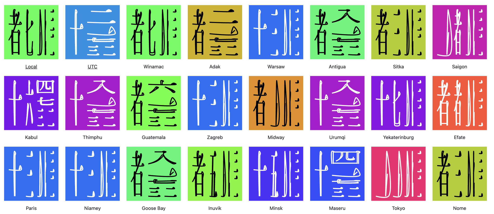

# Word Clocks

Show clocks from time zones using:

```js
Intl.supportedValuesOf("timeZone");
```

I’m actually surprised that there are so many time zones in the world. With APack, it’s easy to arrange hour, minute, and second digits perfectly into squares! I find Japanese fonts and symbolic fonts quite interesting. It’s also enjoyable to experiment with different colors.




